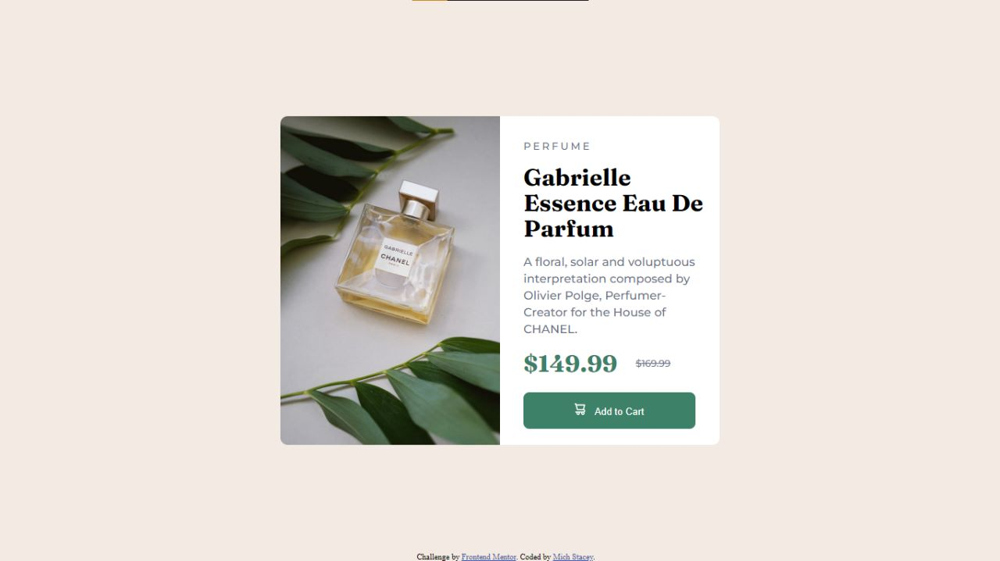
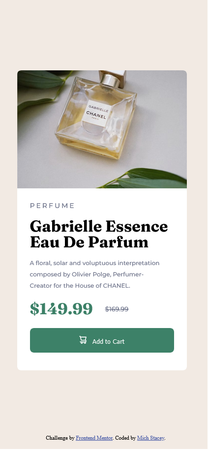

# Frontend Mentor - Product preview card component solution

This is a solution to the [Product preview card component challenge on Frontend Mentor](https://www.frontendmentor.io/challenges/product-preview-card-component-GO7UmttRfa). Frontend Mentor challenges help you improve your coding skills by building realistic projects. 

## Table of contents

- [Overview](#overview)
  - [The challenge](#the-challenge)
  - [Screenshot](#screenshot)
  - [Links](#links)
- [My process](#my-process)
  - [Built with](#built-with)
  - [What I learned](#what-i-learned)
  - [Continued development](#continued-development)
  - [Useful resources](#useful-resources)
- [Author](#author)
- [Acknowledgments](#acknowledgments)

## Overview

### The challenge

The challenge was to build out a product preview card component and get it looking as close to the design as possible. Users should be able to:

- View the optimal layout depending on their device's screen size
- See hover and focus states for interactive elements

### Screenshot




**Note: Delete this note and the paragraphs above when you add your screenshot. If you prefer not to add a screenshot, feel free to remove this entire section.**

### Links

- Solution URL: [FEM Product Preview Card](https://ms-fem-product-preview.netlify.app/)

## My process

### Built with

- Semantic HTML5 markup
- SASS
- CSS custom properties
- Flexbox
- CSS Grid
- Mobile-first workflow
- [Styled Components](https://styled-components.com/) - For styles

**Note: These are just examples. Delete this note and replace the list above with your own choices**

### What I learned

This was the first time I used the ```srcset``` property for an image. It helps the site load faster on mobile sites, but I did find that when resizing the site to check responsiveness I had to reload the site to make sure the right image was being loaded.

```html

```

I also used SASS class concatenation to create classes with a high degree of specificity while maintaining readable and logical code.
```css
.card {
  &__image {}

  &__content {
    &__headers {}
  }
}
```

### Continued development

This was a fun project, and having a prebuilt card that I can include in future projects will surely be useful. I've built it in a way that by changing a few parameters, it could easily be used in another project.

### Useful resources

- [Responsive Images](https://developer.mozilla.org/en-US/docs/Learn/HTML/Multimedia_and_embedding/Responsive_images) - MDN Is alway a great resource, and this helped me figure out how to use ```srcset``` while working on this project..
- [SCSS "&"  explained](https://medium.com/the-crazy-coder/what-scss-means-e448e2ac98d3) - This is a great article which which explains how to use the ampersand in SCSS.

## Author

<!-- - Website - [Mich Stacey](https://www.your-site.com) -->
- Twitter - [@Mich_Codes](https://www.twitter.com/yourusername)
<!-- - Frontend Mentor - [@yourusername](https://twitter.com/Mich_Codes) -->

**Note: Delete this note and add/remove/edit lines above based on what links you'd like to share.**

## Acknowledgments

This is where you can give a hat tip to anyone who helped you out on this project. Perhaps you worked in a team or got some inspiration from someone else's solution. This is the perfect place to give them some credit.

**Note: Delete this note and edit this section's content as necessary. If you completed this challenge by yourself, feel free to delete this section entirely.**
